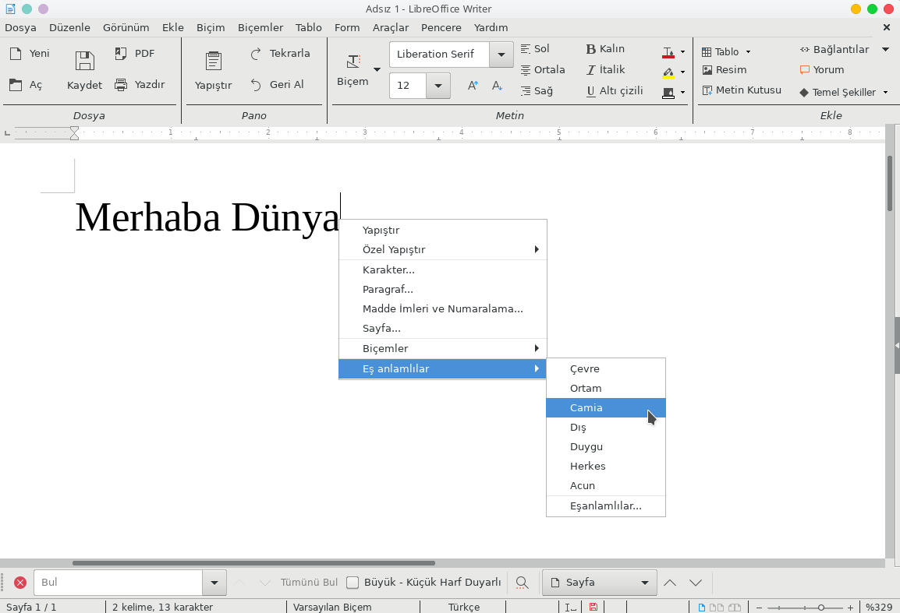

# mythes-tr

mythes-tr, gönüllülerce yürütülen bir Türkçe Eşanlamlı Kelimeler Sözlüğü (Turkish Thesaurus) projesidir. Elektronik ortamda kullanılabilecek bir sözlük oluşturmayı amaçlar.

Belgelendirme için projenin wiki sayfalarına bakabilirsiniz. [LibreOffice'de Türkçe Eşanlamlılar Sözlüğü Denemesi](http://www.youtube.com/watch?v=Cv2Z6afjb7w) başlıklı videoda da Türkçe eşanlamlı kelimeler sözlüğünün ilk halini iş başında görebilirsiniz.

## Türkçe Eşanlamlılar Sözlüğü'nün LibreOffice için Kurulumu

### Linux Kurulumu

- mythes-tr projesini bilgisayarınıza indirin. Bunun için proje sayfasındaki **Clone or download** yolundan veya doğrudan [buradan](https://github.com/maidis/mythes-tr/archive/master.zip) ulaşabileceğiniz bağlantıyı kullanabilirsiniz.
- Arşiv bilgisayarınıza kısa sürede inecektir. Bu arşivi Ark veya benzeri bir arşiv yönetim programıyla açın.
- Eğer grafik arayüz üzerinden sistem dizinlerine yazma hakkı elde edebiliyorsanız Dolphin veya benzeri bir dosya yöneticisiyle `th_tr_TR_v2.dat` ve `th_tr_TR_v2.idx` dosyalarını arşivin açıldığı dizinden kopyalayıp /usr/share/mythes/ dizinine yapıştırın. Bu işlemi konsol üzerinden yapmak daha kolay olabilir: `sudo cp th_tr_TR_v2.* /usr/share/mythes/`
- LibreOffice'i açıp herhangi bir Türkçe kelimeyi sağ tıklayıp içerik menüsünden eşanlamlı kelimelere ulaşmayı deneyerek kurulumun gerçekleşim gerçekleşmediğini test edebilirsiniz.

### Windows Kurulumu

### macOS Kurulumu
